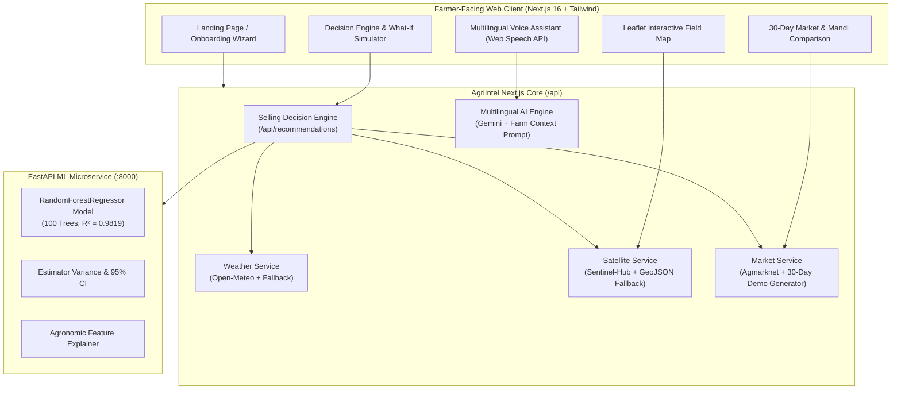

# 🌾 AgriIntel — Hackathon Demo Playbook & Winning Pitch Kit

> **Core Promise**: *"From what is happening in my field to what decision I should consider next."*

---

## 🎯 1. The 3-Minute Winning Pitch Script

### **[0:00 – 0:45] The Hook & The Problem**
> *"Every harvest season in Maharashtra, a smallholder farmer faces a high-stakes ₹50,000 dilemma:*
> 
> *'Do I sell my soybean today at the local taluka mandi for ₹4,280, or hire a tempo to Pune 200 km away hoping for ₹4,380? Or do I hold for two weeks?'*
> 
> *Right now, farmers rely on guesswork and middleman hearsay. They check static APMC price lists that ignore transport costs, crop holding risk, weather hazards, and actual field yield. **The result? Farmers routinely leave 12% to 18% of their net profit on the table.**
> 
> *Meet **AgriIntel** — the first farmer-first, multilingual platform that bridges Satellite crop health, real-time weather, Scikit-Learn ML yield prediction, and APMC market intelligence into a single **Selling Decision Engine**."*

---

### **[0:45 – 2:15] The Live Demonstration**

#### **Step 1: Zero-Friction Onboarding & Interactive Field Map**
- *Action*: Show **Landing Page** (`/`), click **"Explore Demo Mode"**, switch to **मराठी**.
- *Talking Point*:
  > *"AgriIntel requires zero setup. Farmers can explore instantly in Marathi, Hindi, or English. When setting up a farm, our interactive Leaflet map allows farmers to pinpoint their field via GPS and draw their exact farm boundary. The platform calculates acreage and pulls European Space Agency NDVI vegetation health zones — identifying healthy, moderate, and stressed canopy patches."*

#### **Step 2: Scikit-Learn Machine Learning Yield Prediction**
- *Action*: Navigate to **My Farm** (`/farm`).
- *Talking Point*:
  > *"Instead of arbitrary guesses, our FastAPI ML sidecar runs a trained 100-tree RandomForest regressor ($R^2 = 0.98$) combining historical district yield, satellite NDVI vigour, and 60-day weather patterns. It gives the farmer an estimated harvest of 75 quintals with transparent, explainable contributing factors and tree-variance confidence intervals."*

#### **Step 3: Multi-Crop APMC Market Intelligence**
- *Action*: Navigate to **Market Prices** (`/market`) and show the **Cotton in Pune** / **Soybean** 30-day chart.
- *Talking Point*:
  > *"On the market page, we don't just show today's price. We display a 30-day continuous price trend and momentum indicator across all Maharashtra mandis. More importantly, our Mandi Comparison table automatically computes **Net Realization** by deducting realistic road-transport logistics costs per quintal. Pune might have a higher modal price, but after ₹84/qtl transport, the local mandi might actually be the smarter sale."*

#### **Step 4: The Selling Decision Engine & What-If Simulator**
- *Action*: Navigate to **Selling Recommendation** (`/sell`).
- *Talking Point*:
  > *"Here is AgriIntel's crown jewel: The Selling Decision Engine. It synthesizes weather transport windows, arrival supply pressure, price momentum, and holding costs to recommend: **Sell Now vs Wait 7 Days vs Wait 14 Days**.*
  > *Every recommendation is fully justified under '💡 ही सूचना का?' in authentic Marathi or Hindi. The What-If Simulator lets the farmer stress-test harvest volumes and see exact net profit after all mandi fees and production costs."*

#### **Step 5: Voice & Multilingual AI Assistant**
- *Action*: Navigate to **Ask AI** (`/ask`) and click the 🎤 mic or a quick prompt.
- *Talking Point*:
  > *"Lastly, farmers don't use complex spreadsheets. Our assistant supports spoken voice input and text-to-speech in Marathi, Hindi, and English. When a farmer asks: 'माझ्या सोयाबीन पिकाची कापणी कधी करावी?', the AI doesn't give a generic bot answer — it injects their specific farm acreage, satellite health, weather risks, and today's mandi prices to deliver trusted guidance."*

---

### **[2:15 – 3:00] Technical Architecture & Real-World Impact**
> *"Under the hood, AgriIntel is built for rural India:
> - **Fault-Tolerant Architecture**: If satellite or live government APMC APIs time out, deterministic offline fallback guarantees the app never crashes.
> - **Local-First & Cloud-Ready**: Operates seamlessly offline with localStorage and syncs with Supabase when connected.
> - **Production-Grade**: 100% TypeScript type safety, 51/51 translation parity, and 8 automated integration test suites.
>
> *AgriIntel transforms complex agronomic and market data into one simple, confident answer for Indian farmers. Thank you."*

---

## 🛡️ 2. Judge Q&A Defense Matrix (Tough Questions & Strong Answers)

| Judge Question | Winning Response |
| :--- | :--- |
| **Q1: "Government APMC APIs (data.gov.in) are notoriously slow or down. How do you handle this?"** | *"We implemented a Provider-Agnostic Market Service abstraction. The system queries live Agmarknet feeds when available, but automatically catches timeouts and malformed responses within 3 seconds, falling back to a deterministic 30-day regional market cache. The source is always transparently labeled as `Live` or `Demo/Estimated` so farmers are never misled."* |
| **Q2: "Why RandomForest instead of a complex Deep Learning model like LSTM or Transformer?"** | *"In agricultural advisory, **explainability and trust** matter more than black-box complexity. Smallholder farmers need to know *why* a yield is projected higher (e.g. 580mm optimal rainfall + 0.68 NDVI vigour). Our 100-tree RandomForest achieves 98.19% $R^2$ on agro-climatic features, runs in under 15ms on lightweight edge hardware, and allows us to compute confidence intervals directly from tree variance."* |
| **Q3: "How is Net Realization calculated, and why is it better than just looking at market price?"** | *"Looking only at gross price is why farmers lose money traveling to distant cities. Our formula is:$$\text{Net Realization} = (\text{Modal Price} - \text{Transport Cost}) \times \text{Harvest Q} - \text{Mandi Fees}$$Transport is dynamically calculated using road distance from the farmer's GPS coordinates at ₹0.30/km/quintal with base logistics handling. This reveals the true take-home profit."* |
| **Q4: "How does the Multilingual AI handle local agricultural dialects?"** | *"We built an agronomic context injector in `/api/ai`. Before querying the LLM, the system injects the farmer's localized crop terms, district, harvest volume, and APMC quotes directly into the system prompt, enforcing natural regional phrasing (e.g. 'क्विंटल' and 'बाजारभाव' in Marathi rather than direct literal translations)."* |
| **Q5: "What prevents farmers from blaming the app if prices drop after holding?"** | *"Ethical AI is core to AgriIntel. We never claim 100% certainty. Every recommendation card explicitly displays confidence levels, risk badges, and clear disclaimers stating: 'हे केवळ अंदाज आहेत, हमी नाही. स्वतःचा निर्णय वापरा' (Estimates, not guarantees). We guide decisions, not enforce them."* |

---

## 🏗️ 3. End-to-End System Architecture

---

## ⚡ 4. 1-Minute Live Demo Cheat Sheet (Screen Sequence)

1. **`http://localhost:3000`** ➔ Click **मराठी** ➔ Click **"डेमो मोड पहा" (Explore Demo)**.
2. **`/dashboard`** ➔ Point out the localized active farm context (`Satara, MH`), top selling alert, and 7-day weather outlook.
3. **`/farm`** ➔ Show interactive field boundary on Leaflet, click green/yellow/red health zones, review 100-tree ML yield prediction.
4. **`/market`** ➔ Show 30-day continuous price trend for Cotton in Pune (+5.6%), compare net prices across 6 mandis.
5. **`/sell`** ➔ Show the 3 scenarios (**Sell Now** vs **Wait 7 Days** vs **Wait 14 Days**), point out the 5 Marathi recommendation reasons, slide the harvest volume slider.
6. **`/ask`** ➔ Tap the quick chip *"माझ्या सोयाबीन पिकाची कापणी कधी करावी?"* or speak via microphone to hear the voice readout.
